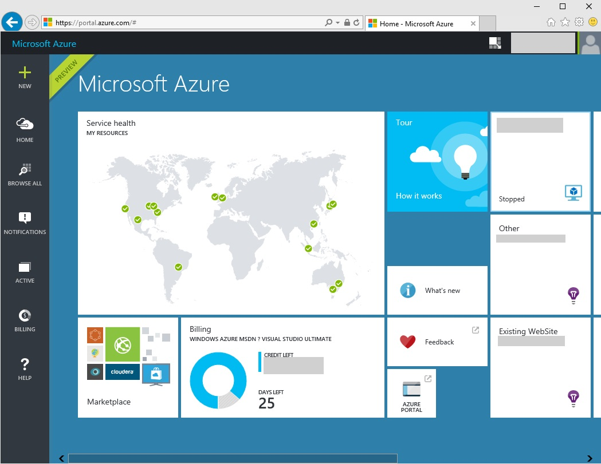
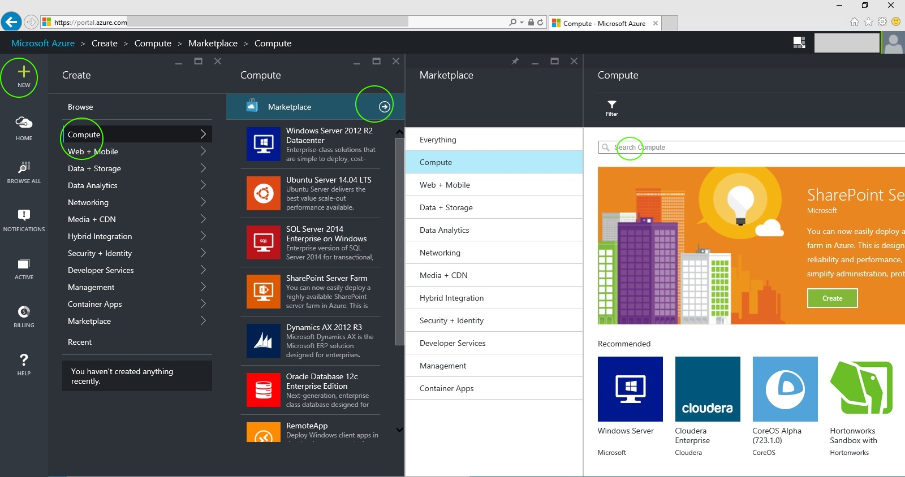
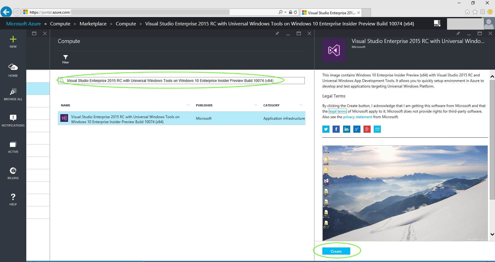
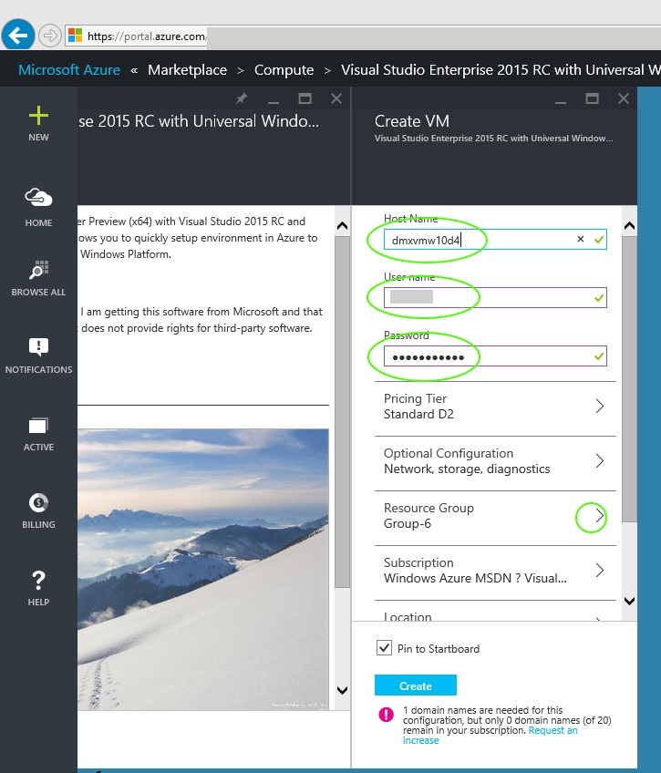
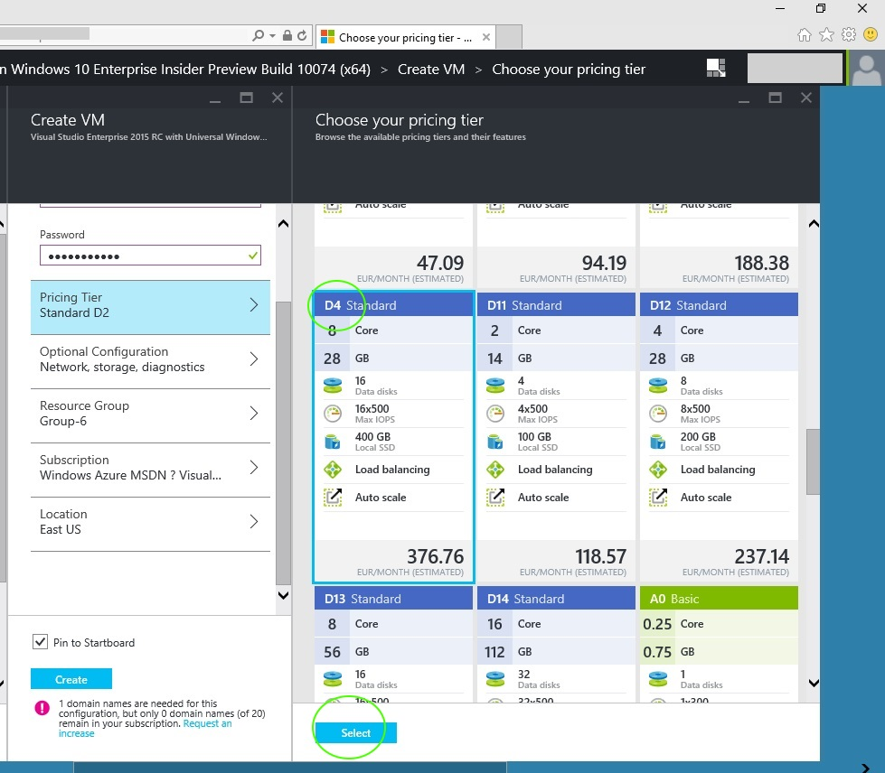
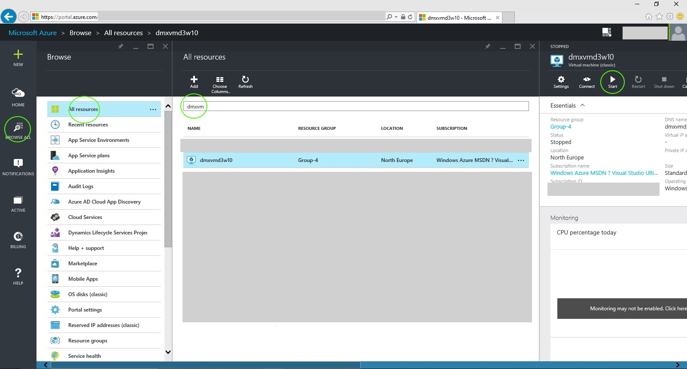
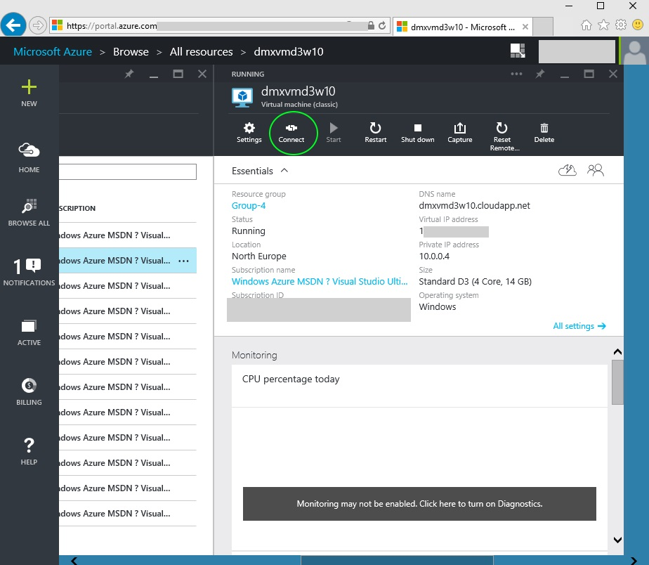
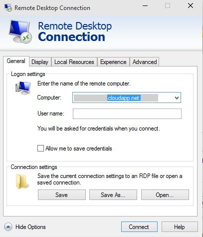
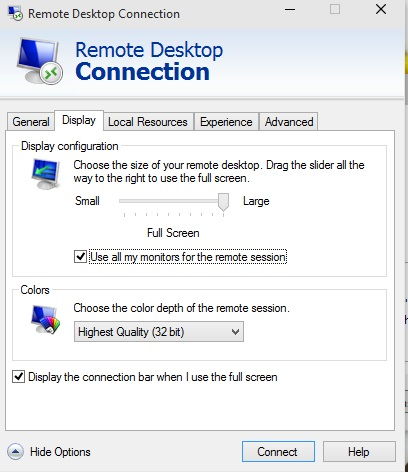

# Developer Dream Machine #
This documentation describes in a step by step guide 
how to set up a perfect developer's dream machine in Azure.
 

If you have a MSDN subscription you can can use this machine to burn the free amount of azure credits you get every month. :-) 

It's all pretty easy. Here's what you want to do step by step:

### 1. Open the Azure Portal ###
Go to <http://portal.azure.com> and log in. If you don't have  an account yet, create one. We don't go into details here how to create an account. I'm pretty sure you get this done.

### 2. Create a virtual machine. ###
Create the virtual machine based on a template in the gallery. There are plenty of templates. For now we select the Windows 10 machine with installed developer tools.

### 3. Find the correct template. ###
The easiest way to find this template is to filter for Windows 10. Select the template that has the devtools installed and click "create".

### 4. Provide names & credentials ### 
As always when setting up a machine you need a name for the machine, a user name for the admin account and a password. Here's a tip: Think about a naming convention for your machines. You might end up having multiple of them soon. How about: YourAcronym.OperationSystem ? Feel free to be creative!

### 5. Config & Create ###
Now select the "Pricing Teer" button. You can choose different hardware configurations here. Make sure to click "View all" if you don't find the machine you're looking for. How about a PC with 8 cores and 28GB Ram? It's up to you. Next to the configurations you can choose you find estimated costs for this machine when the machine runs 24/7 for one month. If you fire up your machine just for a few days it will be cheaper. If you are running within an MSDN subscription your account is set up to not exceed the free monthly credits per default. The worst thing that could happen is that your machine wouldn't run until the beginning of the next month.
It's also possible to change the hardware configuration later. Even if the machine did already run.
Did you find your configuration? Click "Select" and then "Create". This creates your machine (and might take a few minutes).

### 6. Start your machine ###
A direct link to your machine can be found on the startscreen of the azure portal. If you don't find it, you can search for it by clicking "Browse All". Then search for the machine name you provided. When you found it, press the Start button. 

### 7. Connect via remote desktop ###
After a short while (ca. 1 minute) the connect button will be enabled. Click it to open a remote deskotp connection to the virtual machine. Save the Link on your desktop for later use. Then log in with the credentials provided earlier.

### 8. Multiple Monitors ###
Remote Desktop to virtual machines supports multiple monitors! Just right click the .rdp file you saved on the desktop before, click edit select the "Display" tab and check the box to use all your monitors.

### 9. *(Optional)* Connect with a Microsoft account ###
If you want to connect with a Microsoft account on your virtual machine, just create a new user, put the new user in the group of administrators (to make sure remote desktop works) and then log in as the new user. Afterwards you can connect the new user account with the Microsoft account.

### 10. *(Optional)* Set up for Sync - or not ###
Be aware that Windows will automatically sync settings - this might make your VM look like your physical PC. I recommend disabling sync of themes to the virtual machine to be aware of what machine you're working on.

That's it! Have fun!